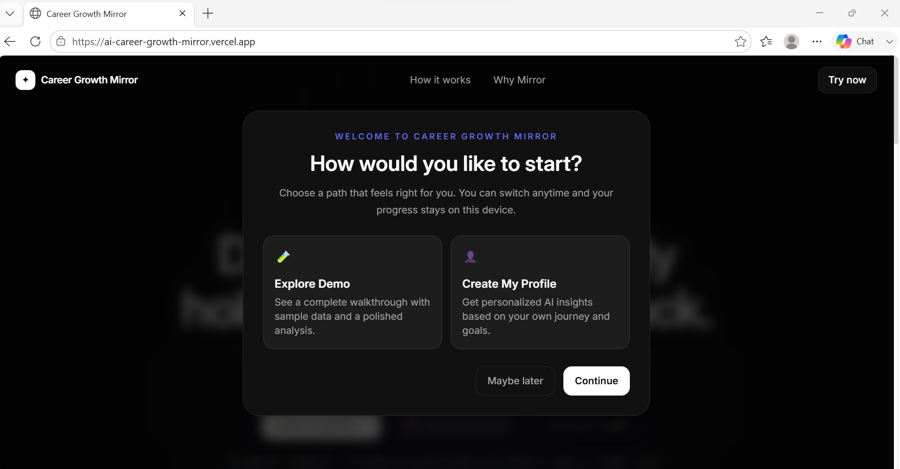
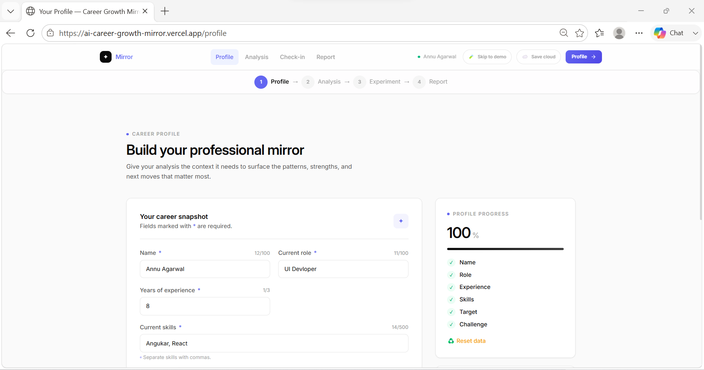
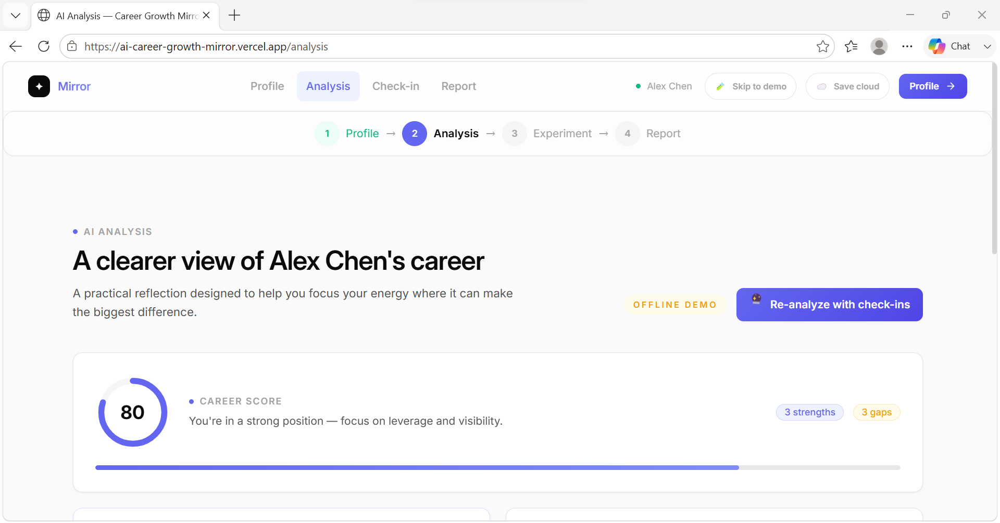
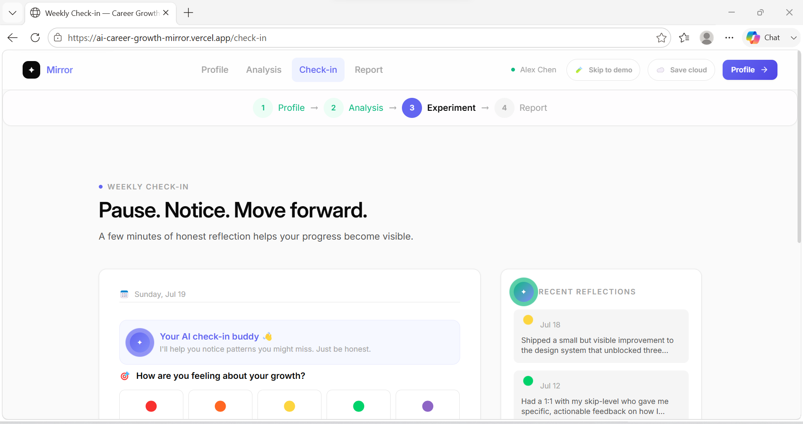
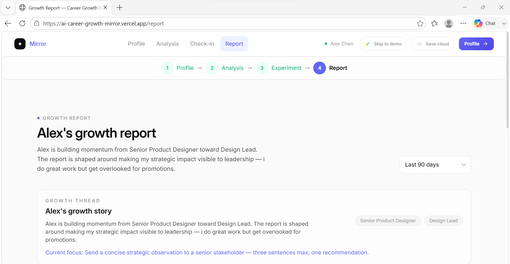
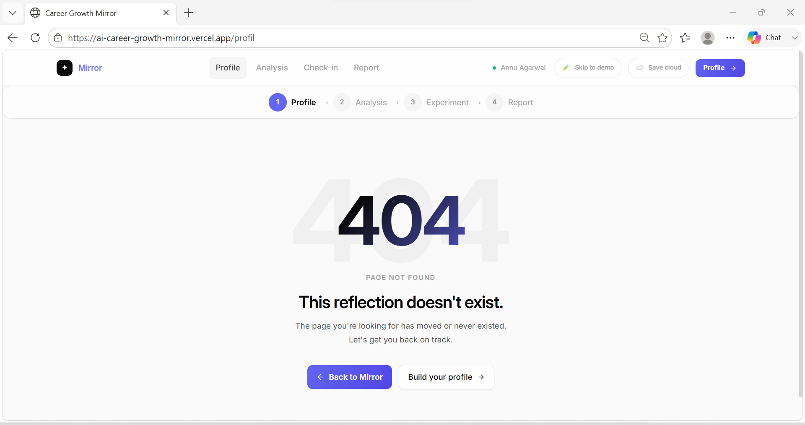
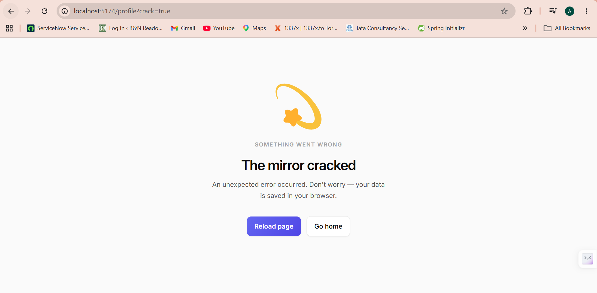

# AI Career Growth Mirror

A judge-ready demo app that turns a career profile, a resume, and weekly check-ins into a practical AI career-growth analysis with a visible live-vs-offline mode.

## Screenshot

### Landing Page

### Profile  Page

### Analysis Page

### Check In Page

### Report Page

### 404 Page

### Mirror Cracked Page



## Demo Status

The complete user journey and AI career analysis experience are implemented. 
The application supports Live AI mode and Offline demo mode. 

Some API-dependent responses may use fallback/mock data when the backend API is unavailable, rate-limited, or not configured. This allows the full product experience to be demonstrated end-to-end.

## Local setup

```bash
npm install
npm run server
npm run dev
```

## Deploy

### Render (API)
- Deploy [server.js](server.js)
- Set environment variables:
  - OPENAI_API_KEY
  - PORT=3001
  - CORS_ORIGINS=https://ai-career-growth-mirror.vercel.app/
  ,http://localhost:5173

### Vercel (frontend)
- Deploy the frontend app
- Set VITE_API_URL=https://aicareergrowthmirror.onrender.com

## Demo script (3 minutes)
1. Open the profile page and fill in your role, target role, challenge, and skills.
2. Upload a TXT resume and note the resume text being used.
3. Generate analysis and show the Live AI badge.
4. Add a check-in, re-analyze with check-ins, and show the experiment update.
5. Turn off the API or use a bad CORS origin to show the Offline demo fallback banner.

## Troubleshooting
- If the Analysis page shows “Offline demo”, check that the API server has OPENAI_API_KEY and that CORS_ORIGINS includes your frontend origin.
- If the resume upload fails, try a plain TXT file or a text-based PDF.
